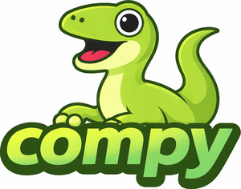

<p align="center">
  
</p>

# Compy

A small, portable [RTSP 1.0] server library in C99, designed for embedded IP cameras.

[RTSP 1.0]: https://datatracker.ietf.org/doc/html/rfc2326

## Highlights

 - **Small.** ~120KB of code, zero external runtime dependencies. Suitable for MIPS/ARM embedded systems.
 - **Unopinionated.** Works with bare POSIX sockets, [libevent], epoll, or any event loop.
 - **Zero-copy.** Parsing uses [array slices] with no allocation or copying.
 - **RFC compliant.** Fully compliant with RFC 2326 MUST requirements.
 - **Secure.** Built-in RFC 2617 Digest authentication with constant-time comparison.

[libevent]: https://libevent.org/
[array slices]: https://github.com/Hirrolot/slice99

## Features

 - RTSP protocol:
   - [x] RTSP 1.0 ([RFC 2326]) — OPTIONS, DESCRIBE, SETUP, PLAY, PAUSE, TEARDOWN, GET_PARAMETER
   - [x] RTP ([RFC 3550])
   - [x] RTCP ([RFC 3550] Section 6) — Sender Reports, Receiver Reports, SDES, BYE
   - [x] RTP/RTCP over TCP (interleaved)
   - [x] RTP/RTCP over UDP (with `server_port` in Transport response)
   - [x] SDP ([RFC 4566])
   - [x] Digest authentication ([RFC 2617])
   - [x] RTSPS (RTSP over TLS)
   - [x] SRTP ([RFC 3711]) — AES-128-CM + HMAC-SHA1-80/32
   - [x] SRTCP ([RFC 3711] Section 3.4)
 - RTP payload formats:
   - [x] H.264 ([RFC 6184]) — single NAL and FU-A fragmentation
   - [x] H.265 ([RFC 7798]) — single NAL and FU fragmentation
 - ONVIF:
   - [x] Backchannel audio (two-way audio) per [ONVIF Streaming Spec] Section 5.3
   - [x] `Require` header tag handling with `551 Option not supported`
 - Receive path:
   - [x] RTP header deserialization
   - [x] Unified receiver for incoming RTCP and backchannel RTP
   - [x] `AudioReceiver` callback interface for backchannel audio
 - TLS backends (compile-time selectable):
   - [x] OpenSSL / LibreSSL
   - [x] wolfSSL
   - [x] mbedTLS (3.6.x and 4.0)
   - [x] BearSSL (SRTP crypto only; TLS server setup requires additional PEM parsing)
 - Known limitations:
   - BearSSL TLS server context is stubbed (SRTP operations work)

[RFC 2326]: https://datatracker.ietf.org/doc/html/rfc2326
[RFC 2617]: https://datatracker.ietf.org/doc/html/rfc2617
[RFC 3550]: https://datatracker.ietf.org/doc/html/rfc3550
[RFC 3711]: https://datatracker.ietf.org/doc/html/rfc3711
[RFC 4566]: https://datatracker.ietf.org/doc/html/rfc4566
[RFC 6184]: https://datatracker.ietf.org/doc/html/rfc6184
[RFC 7798]: https://datatracker.ietf.org/doc/html/rfc7798
[ONVIF Streaming Spec]: https://www.onvif.org/specs/stream/ONVIF-Streaming-Spec.pdf

## Installation

Using CMake [`FetchContent`]:

[`FetchContent`]: https://cmake.org/cmake/help/latest/module/FetchContent.html

```cmake
include(FetchContent)

FetchContent_Declare(
    compy
    GIT_REPOSITORY https://github.com/gtxaspec/compy
    GIT_TAG main
)

FetchContent_MakeAvailable(compy)

target_link_libraries(MyProject compy)
```

### Options

| Option | Description | Default |
|--------|-------------|---------|
| `COMPY_SHARED` | Build a shared library instead of static. | `OFF` |
| `COMPY_FULL_MACRO_EXPANSION` | Show full macro expansion backtraces. | `OFF` |
| `COMPY_TLS_OPENSSL` | Use OpenSSL for TLS/SRTP. | `OFF` |
| `COMPY_TLS_WOLFSSL` | Use wolfSSL for TLS/SRTP. | `OFF` |
| `COMPY_TLS_MBEDTLS` | Use mbedTLS for TLS/SRTP. | `OFF` |
| `COMPY_TLS_BEARSSL` | Use BearSSL for TLS/SRTP (crypto only). | `OFF` |

## Usage

An example server that streams H.264 video and G.711 audio with RTCP and ONVIF backchannel support is at [`examples/server.c`](examples/server.c).

### Build and run

```
cd examples
cmake -B build && cmake --build build
./build/server -v media/bbb/bbb_sunflower_1080p_30fps_normal.h264 \
               -a media/bbb/bbb_sunflower_1080p_30fps_normal.g711a \
               -f 30 -p 8554
```

```
ffplay -rtsp_transport tcp rtsp://localhost:8554/
```

### Server options

| Flag | Description | Default |
|------|-------------|---------|
| `-v <file>` | H.264 video file (Annex B format) | `media/bbb/bbb_sunflower_1080p_30fps_normal.h264` |
| `-a <file>` | G.711 mu-law audio file | `media/bbb/bbb_sunflower_1080p_30fps_normal.g711a` |
| `-f <fps>` | Video frame rate | `30` |
| `-p <port>` | Server port | `8554` |

### Authentication

Compy provides built-in RFC 2617 Digest authentication. Usage in a controller's `before()` hook:

```c
Compy_Auth *auth = Compy_Auth_new("IP Camera", my_credential_lookup, NULL);

static Compy_ControlFlow
Client_before(VSelf, Compy_Context *ctx, const Compy_Request *req) {
    VSELF(Client);
    if (compy_auth_check(self->auth, ctx, req) != 0) {
        return Compy_ControlFlow_Break;  // 401 already sent
    }
    return Compy_ControlFlow_Continue;
}
```

### ONVIF backchannel

When a client sends `Require: www.onvif.org/ver20/backchannel` in DESCRIBE, the server can advertise a backchannel audio stream in SDP:

```
m=audio 0 RTP/AVP 0
a=control:audioback
a=rtpmap:0 PCMU/8000
a=sendonly
```

The `Compy_AudioReceiver` interface delivers incoming backchannel audio to the application via callback.

### SRTP / SRTCP

When compiled with a TLS backend (`-DCOMPY_TLS_OPENSSL=ON`), wrap transports for encrypted media:

```c
Compy_SrtpKeyMaterial key;
compy_srtp_generate_key(&key);

// Wrap RTP transport with SRTP
Compy_Transport udp = compy_transport_udp(fd);
Compy_Transport srtp = compy_transport_srtp(
    udp, Compy_SrtpSuite_AES_CM_128_HMAC_SHA1_80, &key);

// Wrap RTCP transport with SRTCP (same master key)
Compy_Transport rtcp_udp = compy_transport_udp(rtcp_fd);
Compy_Transport srtcp = compy_transport_srtcp(
    rtcp_udp, Compy_SrtpSuite_AES_CM_128_HMAC_SHA1_80, &key);

// Advertise in SDP
char crypto_attr[128];
compy_srtp_format_crypto_attr(
    crypto_attr, sizeof crypto_attr, 1,
    Compy_SrtpSuite_AES_CM_128_HMAC_SHA1_80, &key);
// → "1 AES_CM_128_HMAC_SHA1_80 inline:<base64>"

// Decrypt incoming SRTP (backchannel)
Compy_SrtpRecvCtx *recv = compy_srtp_recv_new(
    Compy_SrtpSuite_AES_CM_128_HMAC_SHA1_80, &key);
compy_srtp_recv_unprotect(recv, packet, &len);  // verify + decrypt in-place
```

## Tests

```
cd tests
cmake -B build && cmake --build build
./build/tests
```

134 tests, 1241 assertions, under Address Sanitizer.

To build with TLS/SRTP tests:

```
cmake -B build -DCOMPY_TLS_OPENSSL=ON && cmake --build build
./build/tests
```

## Architecture

```
Send path (camera → client):

  Application
    |
    v
  NalTransport ------- H.264/H.265 NAL fragmentation (FU-A/FU)
    |
    v
  RtpTransport ------- RTP header, seq/timestamp, stats
    |
    v
  SrtpTransport ------ [optional] AES-128-CM encrypt + HMAC-SHA1 auth tag
    |
    v
  Transport ---------- TCP interleaved ($+channel+len) or UDP (sendmsg)
    |
    v
  TlsWriter ---------- [optional] TLS encrypt (RTSPS)
    |
    v
  Network

RTCP path:

  Compy_Rtcp --------- Sender Reports, Receiver Reports, SDES, BYE
    |
    v
  SrtcpTransport ----- [optional] SRTCP encrypt + E-flag + auth tag
    |
    v
  Transport

Receive path (client → camera):

  Network
    |
    v
  compy_tls_read() --- [optional] TLS decrypt (RTSPS)
    |
    v
  compy_srtp_recv_unprotect() -- [optional] SRTP verify + decrypt
    |                              (64-bit replay window)
    v
  Compy_RtpReceiver -- Demux: RTCP → Compy_Rtcp, RTP → AudioReceiver
    |
    v
  Application (backchannel audio callback)

Security:

  Compy_Auth ---------- RFC 2617 Digest authentication (in before() hook)
  Compy_SrtpRecvCtx --- SRTP/SRTCP decrypt with replay protection
```

## License

[MIT](LICENSE)
